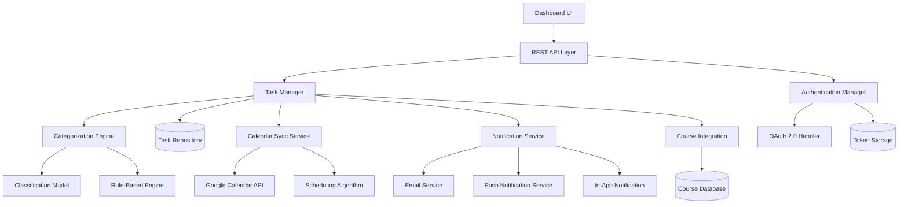

# Design Document: Eisenhower Matrix Task Management

## Overview

The Eisenhower Matrix Task Management feature provides students with an intelligent task prioritization system based on the proven Eisenhower Matrix framework. The system automatically categorizes tasks into four quadrants (Urgent & Important, Important but Not Urgent, Urgent but Not Important, Neither), integrates with Google Calendar for scheduling, and sends timely notifications to help students stay organized.

The design emphasizes:
- Intelligent automatic categorization with manual override capability
- Seamless Google Calendar integration using OAuth 2.0
- Smart scheduling that respects existing commitments
- Real-time visual feedback through an interactive dashboard
- Robust error handling and data persistence

## Architecture

### High-Level Architecture



### Component Responsibilities

1. **Dashboard UI**: Interactive React-based interface for visualizing the matrix and managing tasks
2. **REST API Layer**: Django REST Framework endpoints for all task operations
3. **Task Manager**: Core business logic for task CRUD operations and orchestration
4. **Categorization Engine**: Hybrid system combining rule-based logic and ML for task classification
5. **Calendar Sync Service**: Manages bidirectional synchronization with Google Calendar
6. **Scheduling Algorithm**: Optimizes task placement in calendar based on constraints
7. **Notification Service**: Multi-channel notification delivery system
8. **Authentication Manager**: Handles user authentication and Google OAuth flow
9. **Course Integration**: Links tasks with course data for enhanced categorization

## Components and Interfaces

### Task Manager

**Responsibilities:**
- Create, read, update, delete tasks
- Orchestrate categorization workflow
- Trigger calendar synchronization
- Coordinate with notification service

**Interface:**
```python
class TaskManager:
    def create_task(self, user_id: str, task_data: TaskInput) -> Task:
        """Create a new task and trigger categorization"""
        
    def update_task(self, task_id: str, updates: TaskUpdate) -> Task:
        """Update task and re-evaluate categorization if needed"""
        
    def delete_task(self, task_id: str) -> bool:
        """Delete task and remove from calendar"""
        
    def get_tasks(self, user_id: str, filters: TaskFilters) -> List[Task]:
        """Retrieve tasks with optional filtering"""
        
    def move_task(self, task_id: str, target_quadrant: Quadrant) -> Task:
        """Manually move task to different quadrant"""
        
    def complete_task(self, task_id: str) -> Task:
        """Mark task as complete and archive"""
```

### Categorization Engine

**Responsibilities:**
- Analyze task attributes to determine urgency and importance
- Assign tasks to appropriate quadrants
- Support both automatic and manual categorization
- Learn from user adjustments over time

**Interface:**
```python
class CategorizationEngine:
    def categorize_task(self, task: Task, course_context: Optional[Course]) -> Quadrant:
        """Determine the appropriate quadrant for a task"""
        
    def calculate_urgency(self, deadline: datetime, current_time: datetime) -> float:
        """Calculate urgency score (0.0 to 1.0)"""
        
    def calculate_importance(self, task: Task, course_context: Optional[Course]) -> float:
        """Calculate importance score (0.0 to 1.0)"""
        
    def map_scores_to_quadrant(self, urgency: float, importance: float) -> Quadrant:
        """Map urgency and importance scores to a quadrant"""
```

**Categorization Logic:**

Urgency Calculation:
- Deadline within 24 hours: urgency = 1.0
- Deadline within 48 hours: urgency = 0.8
- Deadline within 1 week: urgency = 0.5
- Deadline within 2 weeks: urgency = 0.3
- Deadline beyond 2 weeks: urgency = 0.1

Importance Calculation:
- Associated with graded assignment: +0.4
- High estimated time (>4 hours): +0.3
- Associated with core course: +0.2
- User-marked as high priority: +0.3
- Related to upcoming exam: +0.2

Quadrant Mapping:
- Urgent & Important: urgency >= 0.6 AND importance >= 0.6
- Important but Not Urgent: urgency < 0.6 AND importance >= 0.6
- Urgent but Not Important: urgency >= 0.6 AND importance < 0.6
- Neither: urgency < 0.6 AND importance < 0.6

### Calendar Sync Service

**Responsibilities:**
- Authenticate with Google Calendar API
- Create, update, delete calendar events
- Handle OAuth token refresh
- Maintain mapping between tasks and calendar events

**Interface:**
```python
class CalendarSyncService:
    def authorize_user(self, user_id: str, auth_code: str) -> bool:
        """Complete OAuth flow and store tokens"""
        
    def sync_task_to_calendar(self, task: Task, quadrant: Quadrant) -> CalendarEvent:
        """Create or update calendar event for task"""
        
    def remove_from_calendar(self, task_id: str) -> bool:
        """Remove task's calendar event"""
        
    def get_existing_events(self, user_id: str, start: datetime, end: datetime) -> List[CalendarEvent]:
        """Retrieve existing calendar events for scheduling"""
        
    def mark_event_complete(self, event_id: str) -> bool:
        """Mark calendar event as completed"""
```

### Scheduling Algorithm

**Responsibilities:**
- Find optimal time slots for tasks
- Avoid conflicts with existing events
- Respect task priorities and deadlines
- Consider user's study patterns

**Interface:**
```python
class SchedulingAlgorithm:
    def find_optimal_slot(
        self, 
        task: Task, 
        existing_events: List[CalendarEvent],
        user_preferences: UserPreferences
    ) -> Optional[TimeSlot]:
        """Find the best time slot for a task"""
        
    def can_fit_before_deadline(
        self, 
        task: Task, 
        existing_events: List[CalendarEvent]
    ) -> bool:
        """Check if task can be scheduled before deadline"""
        
    def split_into_blocks(self, task: Task, max_block_size: timedelta) -> List[TaskBlock]:
        """Split large tasks into manageable blocks"""
```

**Scheduling Strategy:**

For "Urgent & Important" tasks:
1. Find earliest available slot that fits estimated time
2. If no single slot available, split into multiple blocks
3. Schedule as close to current time as possible

For "Important but Not Urgent" tasks:
1. Calculate optimal distribution between now and deadline
2. Prefer scheduling during user's peak productivity hours
3. Leave buffer time before deadline

For "Urgent but Not Important" tasks:
1. Schedule in shorter blocks (max 1 hour)
2. Fill gaps between other commitments
3. Lower priority in conflict resolution

### Notification Service

**Responsibilities:**
- Send notifications across multiple channels
- Respect user preferences
- Queue and retry failed notifications
- Track notification delivery status

**Interface:**
```python
class NotificationService:
    def send_task_reminder(self, user_id: str, task: Task, channel: NotificationChannel) -> bool:
        """Send reminder for upcoming task"""
        
    def send_overdue_summary(self, user_id: str, overdue_tasks: List[Task]) -> bool:
        """Send daily summary of overdue tasks"""
        
    def send_scheduling_alert(self, user_id: str, task: Task, issue: SchedulingIssue) -> bool:
        """Alert user about scheduling problems"""
        
    def configure_preferences(self, user_id: str, preferences: NotificationPreferences) -> bool:
        """Update user's notification preferences"""
```

## Data Models

### Task Model

```python
class Task:
    id: UUID
    user_id: str
    title: str
    description: Optional[str]
    deadline: datetime
    estimated_time: timedelta
    course_id: Optional[str]
    quadrant: Quadrant
    is_manually_categorized: bool
    calendar_event_id: Optional[str]
    is_completed: bool
    completed_at: Optional[datetime]
    created_at: datetime
    updated_at: datetime
    urgency_score: float
    importance_score: float
```

### Quadrant Enum

```python
class Quadrant(Enum):
    URGENT_IMPORTANT = "urgent_important"
    IMPORTANT_NOT_URGENT = "important_not_urgent"
    URGENT_NOT_IMPORTANT = "urgent_not_important"
    NEITHER = "neither"
```

### CalendarEvent Model

```python
class CalendarEvent:
    id: str  # Google Calendar event ID
    task_id: UUID
    user_id: str
    start_time: datetime
    end_time: datetime
    summary: str
    description: str
    is_synced: bool
    last_sync: datetime
```

### NotificationPreferences Model

```python
class NotificationPreferences:
    user_id: str
    email_enabled: bool
    push_enabled: bool
    in_app_enabled: bool
    urgent_important_lead_time: timedelta  # Default: 24 hours
    important_not_urgent_lead_time: timedelta  # Default: 1 hour
    daily_summary_enabled: bool
    daily_summary_time: time  # Default: 8:00 AM
```

### OAuth Token Model

```python
class OAuthToken:
    user_id: str
    access_token: str  # Encrypted
    refresh_token: str  # Encrypted
    token_expiry: datetime
    scope: str
    created_at: datetime
    updated_at: datetime
```

## Correctness Properties

*A property is a characteristic or behavior that should hold true across all valid executions of a system—essentially, a formal statement about what the system should do. Properties serve as the bridge between human-readable specifications and machine-verifiable correctness guarantees.*

i
### Property Reflection

After analyzing all acceptance criteria, I've identified the following consolidations to eliminate redundancy:

**Consolidations:**
- Properties 1.5 and 4.3 both test calendar sync updates - can be combined into a comprehensive calendar sync property
- Properties 6.3 and 6.5 both test impossible scheduling detection - these are the same property
- Properties 10.1 and 10.2 both test data persistence - can be combined into one comprehensive persistence property
- Properties 11.1 and 11.3 both test task completion state - can be combined
- Properties 5.6 and the consolidated calendar sync property overlap - will create one comprehensive property

**Properties to Write:**

1. Task creation and retrieval (1.1, 1.3)
2. Task update triggers re-categorization (1.4)
3. Task deletion removes from all systems (1.5, combined with calendar sync)
4. Categorization produces valid quadrant (2.1)
5. Urgency calculation based on deadline (2.2)
6. Importance calculation considers multiple factors (2.3)
7. Dashboard displays tasks in correct quadrants (3.2, 3.3)
8. Manual recategorization persists and updates calendar (4.1, 4.2, 4.3, 5.6 - combined)
9. Manual categorization is sticky (4.4)
10. Urgent & Important tasks scheduled earliest (5.2)
11. Important but Not Urgent tasks optimally scheduled (5.3)
12. Urgent but Not Important tasks in short blocks (5.4)
13. Neither quadrant tasks not auto-scheduled (5.5)
14. Scheduling avoids conflicts (6.1)
15. Multiple tasks prioritized correctly (6.2)
16. Impossible scheduling detected (6.3, 6.5 - combined)
17. Urgent task notifications sent (7.1)
18. Scheduled task reminders sent (7.2)
19. Overdue task summaries sent (7.3)
20. Multi-channel notification support (7.4)
21. Notification preferences respected (7.5)
22. Authentication required for access (8.1)
23. OAuth tokens encrypted (8.2)
24. Token revocation stops sync (8.3)
25. Data isolation between users (8.4)
26. Course association stored (9.1)
27. Course metadata influences importance (9.2)
28. Course associations displayed (9.3)
29. Tasks retrievable by course (9.5)
30. Task persistence is immediate and complete (10.1, 10.2 - combined)
31. Logout/login round-trip (10.4)
32. Task-calendar mapping maintained (10.5)
33. Task completion archives and syncs (11.1, 11.2, 11.3 - combined)
34. Completion timestamp recorded (11.5)

### Properties

Property 1: Task creation and retrieval round-trip
*For any* valid task data (with title, description, deadline, and estimated time), creating a task and then retrieving all tasks for that user should return a list containing the created task with all its details intact.
**Validates: Requirements 1.1, 1.3**

Property 2: Task update triggers re-categorization
*For any* existing task, when its deadline or other categorization-relevant attributes are updated, the system should re-evaluate and potentially update its quadrant assignment (unless manually categorized).
**Validates: Requirements 1.4**

Property 3: Task deletion removes from all systems
*For any* task with an associated calendar event, deleting the task should remove it from both the task repository and the calendar, leaving no orphaned data.
**Validates: Requirements 1.5**

Property 4: Categorization produces valid quadrant
*For any* task (with or without course association), the categorization engine should assign it to exactly one of the four valid quadrants.
**Validates: Requirements 2.1**

Property 5: Urgency increases as deadline approaches
*For any* two tasks with the same importance but different deadlines, the task with the closer deadline should have a higher or equal urgency score.
**Validates: Requirements 2.2**

Property 6: Importance reflects task attributes
*For any* task, if it has attributes indicating higher importance (graded assignment, high estimated time, core course, high priority), its importance score should be higher than a task without those attributes.
**Validates: Requirements 2.3**

Property 7: Dashboard displays tasks in correct quadrants
*For any* set of tasks with assigned quadrants, the rendered dashboard should display each task in its assigned quadrant with title, deadline, and urgency indicator present in the output.
**Validates: Requirements 3.2, 3.3**

Property 8: Manual recategorization persists and syncs
*For any* task, when manually moved to a different quadrant, the new quadrant assignment should be persisted to the database, the task should be marked as manually categorized, and the calendar event should be updated to reflect the new priority.
**Validates: Requirements 4.1, 4.2, 4.3, 5.6**

Property 9: Manual categorization is sticky
*For any* manually categorized task, subsequent edits to the task (that don't explicitly request re-evaluation) should not change its quadrant assignment.
**Validates: Requirements 4.4**

Property 10: Urgent & Important tasks scheduled earliest
*For any* set of tasks including at least one "Urgent & Important" task, the urgent & important task should be scheduled at an earlier time than tasks in other quadrants (given no existing conflicts).
**Validates: Requirements 5.2**

Property 11: Important but Not Urgent tasks optimally distributed
*For any* "Important but Not Urgent" task, it should be scheduled with sufficient buffer time before its deadline, distributed across multiple sessions if the estimated time is large.
**Validates: Requirements 5.3**

Property 12: Urgent but Not Important tasks in short blocks
*For any* "Urgent but Not Important" task with estimated time greater than 1 hour, it should be scheduled in multiple blocks, each no longer than 1 hour.
**Validates: Requirements 5.4**

Property 13: Neither quadrant tasks not auto-scheduled
*For any* task in the "Neither Urgent nor Important" quadrant, no calendar event should be automatically created unless explicitly requested by the user.
**Validates: Requirements 5.5**

Property 14: Scheduling avoids conflicts
*For any* task being scheduled and any set of existing calendar events, the scheduled time slot should not overlap with any existing event.
**Validates: Requirements 6.1**

Property 15: Same-deadline tasks prioritized correctly
*For any* set of tasks with the same deadline, they should be scheduled in order of decreasing importance score, with higher importance tasks scheduled earlier.
**Validates: Requirements 6.2**

Property 16: Impossible scheduling detected and reported
*For any* task where the estimated time exceeds the available time between now and the deadline (considering existing events), the system should generate an alert notification for the student.
**Validates: Requirements 6.3, 6.5**

Property 17: Urgent task notifications sent timely
*For any* task in the "Urgent & Important" quadrant with a deadline within 24 hours, a high-priority notification should be sent to the student through their enabled channels.
**Validates: Requirements 7.1**

Property 18: Scheduled task reminders sent
*For any* "Important but Not Urgent" task with a scheduled calendar event, a reminder notification should be sent 1 hour before the scheduled start time.
**Validates: Requirements 7.2**

Property 19: Overdue task summaries sent daily
*For any* student with overdue tasks (deadline passed but not completed), a daily summary notification should be sent at their configured summary time.
**Validates: Requirements 7.3**

Property 20: Multi-channel notification delivery
*For any* notification being sent, if multiple channels (email, push, in-app) are enabled in the user's preferences, the notification should be delivered through all enabled channels.
**Validates: Requirements 7.4**

Property 21: Notification preferences respected
*For any* notification, it should only be sent through channels that are enabled in the user's notification preferences.
**Validates: Requirements 7.5**

Property 22: Authentication required for task access
*For any* task operation (create, read, update, delete), attempting the operation without valid authentication should result in an authentication error.
**Validates: Requirements 8.1**

Property 23: OAuth tokens stored encrypted
*For any* OAuth token stored in the database, the access_token and refresh_token fields should be encrypted, not stored in plaintext.
**Validates: Requirements 8.2**

Property 24: Token revocation stops synchronization
*For any* user who revokes calendar access, their OAuth tokens should be deleted from the database and no further calendar synchronization operations should occur for that user.
**Validates: Requirements 8.3**

Property 25: Data isolation between users
*For any* two different users, attempting to access or modify another user's tasks should be denied, ensuring each user can only access their own data.
**Validates: Requirements 8.4**

Property 26: Course association persisted
*For any* task created with a course association, retrieving that task should return the same course association.
**Validates: Requirements 9.1**

Property 27: Course metadata influences importance
*For any* two otherwise identical tasks, the task associated with a course that has higher priority metadata (e.g., graded, core requirement) should have a higher importance score.
**Validates: Requirements 9.2**

Property 28: Course associations displayed in UI
*For any* task with a course association, the rendered dashboard output should include a visual indicator of the course association.
**Validates: Requirements 9.3**

Property 29: Tasks retrievable by course
*For any* course with associated tasks, querying for tasks by that course ID should return all tasks associated with that course.
**Validates: Requirements 9.5**

Property 30: Task persistence is immediate and complete
*For any* task creation or modification, immediately querying the database should return the task with all fields (quadrant, timestamps, modification history) correctly stored.
**Validates: Requirements 10.1, 10.2**

Property 31: Logout/login preserves task state
*For any* set of tasks created by a user, after simulating logout and login, retrieving all tasks should return the same tasks in the same quadrants with all details intact.
**Validates: Requirements 10.4**

Property 32: Task-calendar mapping maintained
*For any* task with a calendar event, the mapping between task ID and calendar event ID should be consistently maintained in both directions.
**Validates: Requirements 10.5**

Property 33: Task completion archives and syncs
*For any* task that is marked as complete, it should be moved to archived state, not appear in the default matrix view, and its corresponding calendar event should be marked as completed.
**Validates: Requirements 11.1, 11.2, 11.3**

Property 34: Completion timestamp recorded
*For any* task that is marked as complete, the completed_at timestamp should be set to the time of completion and persisted to the database.
**Validates: Requirements 11.5**

## Error Handling

### Error Categories and Strategies

**1. Google Calendar API Errors**
- **OAuth failures**: Display clear message with re-authorization link
- **Rate limiting**: Implement exponential backoff and queue operations
- **Network timeouts**: Retry up to 3 times with increasing delays
- **Invalid event data**: Validate before sending, log details for debugging

**2. Database Errors**
- **Connection failures**: Retry with exponential backoff, show user-friendly message
- **Constraint violations**: Validate data before insertion, return specific field errors
- **Transaction failures**: Rollback and retry, maintain data consistency

**3. Validation Errors**
- **Missing required fields**: Highlight specific fields, provide inline error messages
- **Invalid date formats**: Show expected format, suggest corrections
- **Deadline in past**: Warn user, allow override for historical tracking

**4. Scheduling Conflicts**
- **No available slots**: Alert user, suggest deadline extension or task splitting
- **Overlapping events**: Show conflict details, offer manual scheduling
- **Insufficient time**: Calculate shortfall, recommend reducing scope or extending deadline

**5. Notification Failures**
- **Email delivery failures**: Log error, retry after delay, try alternative channels
- **Push notification errors**: Fall back to in-app notifications
- **Channel unavailable**: Skip that channel, continue with others

### Error Response Format

```python
class ErrorResponse:
    error_code: str  # Machine-readable error code
    message: str  # User-friendly message
    details: Optional[Dict]  # Additional context
    suggested_actions: List[str]  # What user can do
    retry_possible: bool  # Whether operation can be retried
```

### Logging Strategy

- **INFO**: Successful operations, user actions
- **WARNING**: Recoverable errors, fallback actions taken
- **ERROR**: Failed operations requiring attention
- **CRITICAL**: System-level failures, data integrity issues

All logs include: user_id, task_id (if applicable), timestamp, operation, and correlation_id for tracing.

## Testing Strategy

### Dual Testing Approach

The testing strategy employs both unit tests and property-based tests to ensure comprehensive coverage:

**Unit Tests** focus on:
- Specific examples demonstrating correct behavior
- Edge cases (empty tasks, invalid input, expired sessions)
- Integration points between components
- Error conditions and recovery

**Property-Based Tests** focus on:
- Universal properties that hold for all inputs
- Comprehensive input coverage through randomization
- Invariants that must be maintained
- Round-trip properties (create/retrieve, serialize/deserialize)

Together, unit tests catch concrete bugs while property tests verify general correctness across the input space.

### Property-Based Testing Configuration

**Library Selection:**
- **Python**: Use Hypothesis for property-based testing
- **JavaScript/TypeScript**: Use fast-check for frontend testing

**Test Configuration:**
- Minimum 100 iterations per property test (due to randomization)
- Each property test references its design document property
- Tag format: `# Feature: eisenhower-matrix-task-management, Property {number}: {property_text}`

**Example Property Test Structure:**

```python
from hypothesis import given, strategies as st
import hypothesis

@given(
    title=st.text(min_size=1, max_size=200),
    description=st.text(max_size=1000),
    deadline=st.datetimes(min_value=datetime.now()),
    estimated_time=st.timedeltas(min_value=timedelta(minutes=15), max_value=timedelta(hours=8))
)
@hypothesis.settings(max_examples=100)
def test_task_creation_retrieval_roundtrip(title, description, deadline, estimated_time):
    """
    Feature: eisenhower-matrix-task-management, Property 1: Task creation and retrieval round-trip
    For any valid task data, creating a task and then retrieving all tasks should return the created task.
    """
    # Test implementation
    pass
```

### Test Coverage Requirements

**Component-Level Tests:**
- Task Manager: CRUD operations, orchestration logic
- Categorization Engine: Urgency/importance calculations, quadrant mapping
- Calendar Sync Service: OAuth flow, event creation/update/deletion
- Scheduling Algorithm: Conflict detection, optimal slot finding
- Notification Service: Multi-channel delivery, preference enforcement

**Integration Tests:**
- End-to-end task creation through calendar sync
- Manual recategorization flow
- Task completion and archival
- OAuth token refresh flow
- Notification delivery pipeline

**Property-Based Tests:**
- All 34 correctness properties from the design document
- Each property implemented as a single property-based test
- Minimum 100 iterations per test

### Test Data Strategies

**Generators for Property Tests:**
- Valid tasks with random attributes
- Tasks with various deadline ranges (past, near future, far future)
- Tasks with and without course associations
- Calendar events with random time slots
- User preferences with random channel configurations

**Edge Cases for Unit Tests:**
- Empty title (should reject)
- Deadline in the past
- Estimated time of 0 or negative
- Very large estimated time (>24 hours)
- Tasks with deadlines within 48 hours (urgency threshold)
- Tasks associated with graded courses (importance threshold)
- Empty matrix (no tasks)
- Invalid drag-and-drop locations
- Expired OAuth tokens
- Network failures during sync

### Mocking Strategy

**External Services to Mock:**
- Google Calendar API (for most tests)
- Email service
- Push notification service
- Database (for some unit tests)

**Real Integration Tests:**
- At least one end-to-end test with real Google Calendar API (using test account)
- Real database for integration tests
- Real notification delivery for smoke tests

### Continuous Testing

- Run unit tests on every commit
- Run property-based tests on every pull request
- Run integration tests nightly
- Monitor test execution time and optimize slow tests
- Track property test failure rates to identify flaky tests
