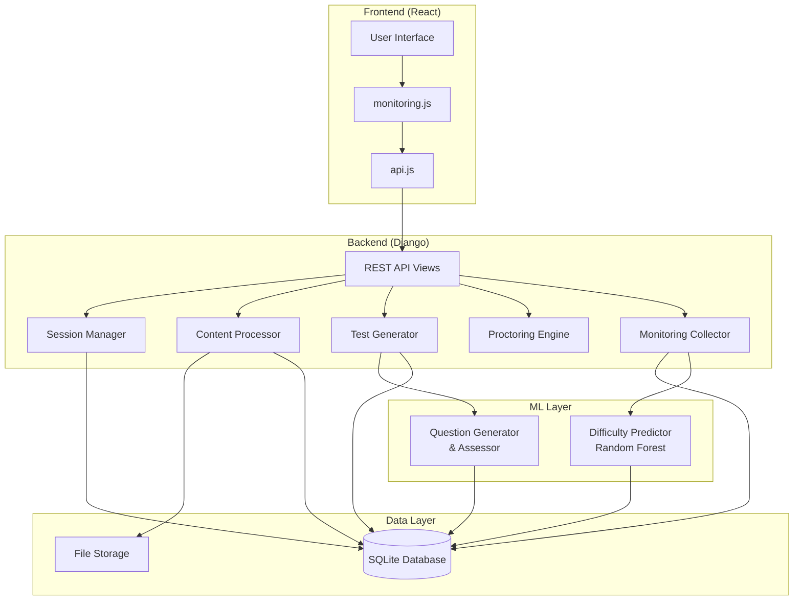

# Design Document: Study Session Monitoring and Testing System

## Overview

The Study Session Monitoring and Testing System is a comprehensive backend solution that integrates with an existing Django REST API and React frontend to provide intelligent, adaptive learning experiences. The system monitors user engagement during study sessions, automatically generates tests from studied content, and uses machine learning to adapt difficulty levels based on performance.

### Key Features

- **Dual Session Modes**: Recommended (2-hour with flexible break) and Standard (Pomodoro-style)
- **Multi-Format Content Support**: YouTube, PDF, DOCX, PPT
- **Real-Time Monitoring**: Track engagement, focus, and study patterns
- **AMCAT-Level Proctoring**: Prevent tab switching, copy-paste, and unauthorized screenshots
- **Automatic Test Generation**: Create MCQ, Short Answer, and Problem-Solving questions
- **ML-Powered Adaptation**: Two-model system for question generation and difficulty prediction
- **Interactive Tools**: RAG chat interface and whiteboard with screenshot capability

### Technology Stack

- **Backend**: Django 4.x with Django REST Framework
- **Database**: SQLite (existing db.sqlite3)
- **ML Models**: 
  - Model 1: Random Forest Classifier (joblib) - Already trained
  - Model 2: To be determined (OpenAI GPT-3.5-turbo or similar)
- **Content Processing**: youtube-transcript-api, PyPDF2, python-pptx, python-docx
- **Frontend Integration**: React with existing monitoring.js and api.js

## Architecture

### System Components



### Data Flow

1. **Session Start Flow**:
   ```
   User → Frontend → API → SessionManager → Database
   Frontend ← SessionID + Config ← API
   ```

2. **Content Processing Flow**:
   ```
   User uploads content → API → ContentProcessor
   ContentProcessor → Extract text → Store in DB
   ContentProcessor → Extract concepts → Store in DB
   ```

3. **Monitoring Flow**:
   ```
   Frontend (monitoring.js) → Events → API
   API → MonitoringCollector → Aggregate metrics
   MonitoringCollector → Store in DB
   ```

4. **Test Generation Flow**:
   ```
   Session ends → API → TestGenerator
   TestGenerator → Model2 (generate questions)
   Model2 → Questions → Store in DB
   API → Return test to Frontend
   ```

5. **Assessment Flow**:
   ```
   User submits answers → API → Evaluator
   Evaluator → Model2 (assess short answer/problem solving)
   Evaluator → Calculate scores → Identify weak areas
   Evaluator → Model1 (predict next difficulty)
   Model1 → Update difficulty → Store in DB
   ```

## Components and Interfaces

### 1. Session Manager

**Purpose**: Manage study session lifecycle, timers, and state.

**Responsibilities**:
- Create and configure session instances
- Track session timing (study time, break time)
- Enforce session rules (Recommended vs Standard)
- Trigger break reminders
- Handle session completion

**Interface**:

```python
class SessionManager:
    def create_session(
        user: User,
        session_type: str,  # 'recommended' or 'standard'
        content_id: int
    ) -> StudySession:
        """Create a new study session"""
        
    def start_break(session_id: int) -> BreakInfo:
        """Start break timer"""
        
    def end_break(session_id: int) -> SessionInfo:
        """End break and resume session"""
        
    def check_reminder_trigger(session: StudySession) -> bool:
        """Check if break reminder should be shown"""
        
    def complete_session(session_id: int) -> SessionSummary:
        """Mark session as complete and return summary"""
```

**Database Models** (extend existing):

```python
class StudySession(models.Model):
    SESSION_TYPES = [
        ('recommended', 'Recommended Session'),
        ('standard', 'Standard Session'),
    ]
    
    user = models.ForeignKey(User, on_delete=models.CASCADE)
    content = models.ForeignKey(Content, on_delete=models.CASCADE)
    session_type = models.CharField(max_length=20, choices=SESSION_TYPES)
    
    # Timing
    started_at = models.DateTimeField(auto_now_add=True)
    ended_at = models.DateTimeField(null=True, blank=True)
    study_duration_seconds = models.IntegerField(default=0)
    break_duration_seconds = models.IntegerField(default=0)
    
    # Break tracking
    break_started_at = models.DateTimeField(null=True, blank=True)
    break_used = models.BooleanField(default=False)
    break_expired = models.BooleanField(default=False)
    
    # Reminders
    reminder_70_shown = models.BooleanField(default=False)
    reminder_90_shown = models.BooleanField(default=False)
    
    # Status
    is_active = models.BooleanField(default=True)
    is_completed = models.BooleanField(default=False)
```

### 2. Content Processor

**Purpose**: Extract and process content from various sources.

**Responsibilities**:
- Extract text from YouTube (captions/transcripts)
- Extract text from PDF files
- Extract text from DOCX files
- Extract text and slides from PPT files
- Identify key concepts from extracted text
- Store processed content in database

**Interface** (extends existing):

```python
class ContentProcessor:
    def process_youtube(url: str) -> ProcessedContent:
        """Extract captions from YouTube video or playlist"""
        
    def process_youtube_playlist(url: str) -> List[ProcessedContent]:
        """Extract captions from all videos in playlist"""
        
    def process_pdf(file_path: str) -> ProcessedContent:
        """Extract text from PDF"""
        
    def process_docx(file_path: str) -> ProcessedContent:
        """Extract text from Word document"""
        
    def process_ppt(file_path: str) -> ProcessedContent:
        """Extract text and slides from PowerPoint"""
        
    def extract_concepts(text: str) -> List[str]:
        """Identify key concepts from text"""
```

**Enhancements Needed**:
- Add YouTube playlist support
- Improve concept extraction (use NLP if available)
- Add error handling for corrupted files
- Add content validation

### 3. Proctoring Engine

**Purpose**: Enforce AMCAT-level rules and monitor violations.

**Responsibilities**:
- Track tab switches
- Prevent copy-paste operations
- Prevent unauthorized screenshots
- Allow whiteboard and chat screenshots
- Request and manage camera permissions
- Record proctoring events

**Interface**:

```python
class ProctoringEngine:
    def initialize_proctoring(session_id: int) -> ProctoringConfig:
        """Initialize proctoring for session"""
        
    def record_tab_switch(session_id: int, timestamp: datetime) -> None:
        """Record tab switch violation"""
        
    def record_copy_attempt(session_id: int, timestamp: datetime) -> None:
        """Record copy attempt"""
        
    def record_paste_attempt(session_id: int, timestamp: datetime) -> None:
        """Record paste attempt"""
        
    def record_screenshot_attempt(
        session_id: int,
        source: str,  # 'content', 'whiteboard', 'chat'
        timestamp: datetime
    ) -> bool:
        """Record screenshot attempt, return if allowed"""
        
    def get_violation_summary(session_id: int) -> ViolationSummary:
        """Get summary of all violations"""
```

**Database Models**:

```python
class ProctoringEvent(models.Model):
    EVENT_TYPES = [
        ('tab_switch', 'Tab Switch'),
        ('copy_attempt', 'Copy Attempt'),
        ('paste_attempt', 'Paste Attempt'),
        ('screenshot_blocked', 'Screenshot Blocked'),
        ('screenshot_allowed', 'Screenshot Allowed'),
        ('camera_enabled', 'Camera Enabled'),
        ('camera_disabled', 'Camera Disabled'),
    ]
    
    session = models.ForeignKey(StudySession, on_delete=models.CASCADE)
    event_type = models.CharField(max_length=30, choices=EVENT_TYPES)
    timestamp = models.DateTimeField(auto_now_add=True)
    details = models.JSONField(default=dict)
```

### 4. Monitoring Collector

**Purpose**: Collect and aggregate engagement metrics during study sessions.

**Responsibilities**:
- Receive monitoring events from frontend
- Calculate engagement scores
- Track study speed and patterns
- Aggregate metrics for ML model input
- Store monitoring data

**Interface** (extends existing MonitoringViewSet):

```python
class MonitoringCollector:
    def record_event(
        session_id: int,
        event_type: str,
        event_data: dict
    ) -> None:
        """Record a monitoring event"""
        
    def calculate_engagement_score(session_id: int) -> float:
        """Calculate current engagement score (0-100)"""
        
    def calculate_study_speed(session_id: int) -> float:
        """Calculate content consumption rate"""
        
    def get_study_habits(session_id: int) -> dict:
        """Analyze study patterns and habits"""
        
    def aggregate_metrics(session_id: int) -> MonitoringMetrics:
        """Aggregate all metrics for ML model"""
```

**Metrics Calculated**:
- Total time vs active time ratio
- Tab switch frequency
- Focus loss frequency
- Content interaction rate (scrolling, pausing, replaying)
- Engagement score (0-100)
- Study speed (content units per minute)

### 5. Test Generator

**Purpose**: Generate tests automatically after study sessions.

**Responsibilities**:
- Generate MCQ questions
- Generate Short Answer questions
- Generate Problem-Solving questions
- Ensure balanced question distribution
- Map questions to concepts
- Use Model 2 for question generation

**Interface** (extends existing):

```python
class TestGenerator:
    def generate_test(
        session_id: int,
        difficulty: int,
        question_count: int
    ) -> Test:
        """Generate complete test from session content"""
        
    def generate_mcq_questions(
        content: str,
        concepts: List[str],
        difficulty: int,
        count: int
    ) -> List[MCQQuestion]:
        """Generate MCQ questions"""
        
    def generate_short_answer_questions(
        content: str,
        concepts: List[str],
        difficulty: int,
        count: int
    ) -> List[ShortAnswerQuestion]:
        """Generate short answer questions"""
        
    def generate_problem_solving_questions(
        content: str,
        concepts: List[str],
        difficulty: int,
        count: int
    ) -> List[ProblemSolvingQuestion]:
        """Generate problem-solving questions"""
        
    def balance_question_distribution(
        difficulty: int
    ) -> QuestionDistribution:
        """Calculate question type distribution"""
```

**Question Distribution**:
- Difficulty 1 (Easy): 10 questions (4 MCQ, 3 Short Answer, 3 Problem Solving)
- Difficulty 2 (Medium): 12 questions (5 MCQ, 4 Short Answer, 3 Problem Solving)
- Difficulty 3 (Hard): 15 questions (6 MCQ, 5 Short Answer, 4 Problem Solving)

**Database Models** (extend existing):

```python
class Test(models.Model):
    session = models.ForeignKey(StudySession, on_delete=models.CASCADE)
    user = models.ForeignKey(User, on_delete=models.CASCADE)
    difficulty_level = models.IntegerField(validators=[MinValueValidator(1), MaxValueValidator(3)])
    
    # Question counts
    total_questions = models.IntegerField()
    mcq_count = models.IntegerField()
    short_answer_count = models.IntegerField()
    problem_solving_count = models.IntegerField()
    
    # Timing
    created_at = models.DateTimeField(auto_now_add=True)
    started_at = models.DateTimeField(null=True, blank=True)
    completed_at = models.DateTimeField(null=True, blank=True)
    
    # Results
    score = models.FloatField(null=True, blank=True)
    is_completed = models.BooleanField(default=False)

class TestQuestion(models.Model):
    QUESTION_TYPES = [
        ('mcq', 'Multiple Choice'),
        ('short_answer', 'Short Answer'),
        ('problem_solving', 'Problem Solving'),
    ]
    
    test = models.ForeignKey(Test, on_delete=models.CASCADE, related_name='questions')
    question_type = models.CharField(max_length=20, choices=QUESTION_TYPES)
    question_text = models.TextField()
    
    # For MCQ
    options = models.JSONField(null=True, blank=True)
    correct_answer_index = models.IntegerField(null=True, blank=True)
    
    # For Short Answer and Problem Solving
    expected_answer = models.TextField(null=True, blank=True)
    
    # Common fields
    explanation = models.TextField()
    concept = models.CharField(max_length=200)
    difficulty = models.IntegerField()
    order = models.IntegerField()

class TestAnswer(models.Model):
    question = models.ForeignKey(TestQuestion, on_delete=models.CASCADE)
    user = models.ForeignKey(User, on_delete=models.CASCADE)
    
    # Answer data
    answer_text = models.TextField()  # For all types
    selected_index = models.IntegerField(null=True, blank=True)  # For MCQ
    
    # Evaluation
    is_correct = models.BooleanField(null=True, blank=True)
    score = models.FloatField(null=True, blank=True)  # 0-100 for ML-evaluated answers
    
    # Timing
    time_taken_seconds = models.IntegerField()
    answered_at = models.DateTimeField(auto_now_add=True)
```

### 6. Answer Evaluator

**Purpose**: Evaluate test answers and calculate scores.

**Responsibilities**:
- Auto-score MCQ questions
- Use Model 2 to evaluate Short Answer questions
- Use Model 2 to evaluate Problem-Solving questions
- Calculate overall test score
- Identify weak areas (concepts with <70% accuracy)
- Prepare data for Model 1

**Interface**:

```python
class AnswerEvaluator:
    def evaluate_mcq(
        question: TestQuestion,
        answer: TestAnswer
    ) -> EvaluationResult:
        """Evaluate MCQ answer"""
        
    def evaluate_short_answer(
        question: TestQuestion,
        answer: TestAnswer
    ) -> EvaluationResult:
        """Use Model 2 to evaluate short answer"""
        
    def evaluate_problem_solving(
        question: TestQuestion,
        answer: TestAnswer
    ) -> EvaluationResult:
        """Use Model 2 to evaluate problem-solving answer"""
        
    def calculate_test_score(test_id: int) -> TestScore:
        """Calculate overall test score"""
        
    def identify_weak_areas(test_id: int) -> List[WeakArea]:
        """Identify concepts with <70% accuracy"""
        
    def prepare_ml_input(
        test_id: int,
        session_id: int
    ) -> MLInputData:
        """Prepare data for Model 1"""
```

### 7. ML Model Integration

#### Model 1: Adaptive Difficulty Predictor (Already Implemented)

**Purpose**: Predict next difficulty level based on performance.

**Input Features**:
- accuracy: float (0-100)
- avg_time_per_question: float (seconds)
- sessions_completed: int
- first_attempt_correct: float (0-100)
- mastery_level: float (0-1)
- is_new_topic: int (0 or 1)
- score_trend: float (-50 to +50)
- current_difficulty: int (1-3)

**Output**:
- next_difficulty: int (1, 2, or 3)

**Implementation**: Already exists in `ml_predictor.py`

#### Model 2: Question Generator and Assessor (To Be Implemented)

**Purpose**: Generate questions and assess open-ended answers.

**Approach Options**:

1. **OpenAI GPT-3.5-turbo** (Recommended):
   - Pros: High-quality questions, good assessment accuracy
   - Cons: Requires API key, costs per request
   - Implementation: Already partially implemented in `question_generator.py`

2. **Open-Source Alternative (BERT/T5)**:
   - Pros: No API costs, runs locally
   - Cons: Lower quality, requires fine-tuning
   - Implementation: Would need additional setup

**Recommended**: Use OpenAI GPT-3.5-turbo with template fallback

**Interface**:

```python
class QuestionGeneratorModel:
    def generate_questions(
        content: str,
        concepts: List[str],
        difficulty: int,
        question_types: List[str],
        count: int
    ) -> List[Question]:
        """Generate questions from content"""
        
    def assess_answer(
        question: str,
        expected_answer: str,
        user_answer: str,
        question_type: str
    ) -> AssessmentResult:
        """Assess open-ended answer"""
```

**Assessment Prompt Template**:

```
Evaluate the following answer:

Question: {question}
Expected Answer: {expected_answer}
User Answer: {user_answer}

Provide:
1. Score (0-100)
2. Is Correct (true/false)
3. Feedback

Return as JSON:
{
  "score": 85,
  "is_correct": true,
  "feedback": "Good answer, covers main points..."
}
```

### 8. Whiteboard Manager

**Purpose**: Manage whiteboard functionality and screenshots.

**Responsibilities**:
- Store whiteboard state
- Handle screenshot requests
- Handle download requests
- Clear whiteboard
- Track whiteboard usage

**Interface**:

```python
class WhiteboardManager:
    def save_whiteboard_state(
        session_id: int,
        state_data: dict
    ) -> None:
        """Save current whiteboard state"""
        
    def capture_screenshot(
        session_id: int,
        image_data: bytes
    ) -> str:
        """Save screenshot and return URL"""
        
    def download_whiteboard(session_id: int) -> bytes:
        """Generate downloadable whiteboard file"""
        
    def clear_whiteboard(session_id: int) -> None:
        """Clear whiteboard state"""
```

**Database Models**:

```python
class WhiteboardSnapshot(models.Model):
    session = models.ForeignKey(StudySession, on_delete=models.CASCADE)
    image = models.ImageField(upload_to='whiteboard_snapshots/')
    created_at = models.DateTimeField(auto_now_add=True)
```

### 9. RAG Chat Integration

**Purpose**: Integrate with existing RAG chat backend.

**Responsibilities**:
- Forward chat queries to RAG backend
- Return responses to frontend
- Track chat usage as engagement events

**Interface**:

```python
class RAGChatIntegration:
    def send_query(
        session_id: int,
        query: str,
        context: str
    ) -> ChatResponse:
        """Send query to RAG backend"""
        
    def record_chat_interaction(
        session_id: int,
        query: str,
        response: str
    ) -> None:
        """Record chat usage"""
```

**Note**: Assumes existing RAG backend is accessible via API or internal function call.

## Data Models

### Complete Database Schema

```python
# New Models

class StudySession(models.Model):
    """Study session with timing and break tracking"""
    SESSION_TYPES = [
        ('recommended', 'Recommended Session'),
        ('standard', 'Standard Session'),
    ]
    
    user = models.ForeignKey(User, on_delete=models.CASCADE)
    content = models.ForeignKey(Content, on_delete=models.CASCADE)
    session_type = models.CharField(max_length=20, choices=SESSION_TYPES)
    
    started_at = models.DateTimeField(auto_now_add=True)
    ended_at = models.DateTimeField(null=True, blank=True)
    study_duration_seconds = models.IntegerField(default=0)
    break_duration_seconds = models.IntegerField(default=0)
    
    break_started_at = models.DateTimeField(null=True, blank=True)
    break_used = models.BooleanField(default=False)
    break_expired = models.BooleanField(default=False)
    
    reminder_70_shown = models.BooleanField(default=False)
    reminder_90_shown = models.BooleanField(default=False)
    
    is_active = models.BooleanField(default=True)
    is_completed = models.BooleanField(default=False)

class ProctoringEvent(models.Model):
    """Proctoring violations and events"""
    EVENT_TYPES = [
        ('tab_switch', 'Tab Switch'),
        ('copy_attempt', 'Copy Attempt'),
        ('paste_attempt', 'Paste Attempt'),
        ('screenshot_blocked', 'Screenshot Blocked'),
        ('screenshot_allowed', 'Screenshot Allowed'),
        ('camera_enabled', 'Camera Enabled'),
        ('camera_disabled', 'Camera Disabled'),
    ]
    
    session = models.ForeignKey(StudySession, on_delete=models.CASCADE)
    event_type = models.CharField(max_length=30, choices=EVENT_TYPES)
    timestamp = models.DateTimeField(auto_now_add=True)
    details = models.JSONField(default=dict)

class Test(models.Model):
    """Generated test from study session"""
    session = models.ForeignKey(StudySession, on_delete=models.CASCADE)
    user = models.ForeignKey(User, on_delete=models.CASCADE)
    difficulty_level = models.IntegerField(validators=[MinValueValidator(1), MaxValueValidator(3)])
    
    total_questions = models.IntegerField()
    mcq_count = models.IntegerField()
    short_answer_count = models.IntegerField()
    problem_solving_count = models.IntegerField()
    
    created_at = models.DateTimeField(auto_now_add=True)
    started_at = models.DateTimeField(null=True, blank=True)
    completed_at = models.DateTimeField(null=True, blank=True)
    
    score = models.FloatField(null=True, blank=True)
    is_completed = models.BooleanField(default=False)

class TestQuestion(models.Model):
    """Individual test question"""
    QUESTION_TYPES = [
        ('mcq', 'Multiple Choice'),
        ('short_answer', 'Short Answer'),
        ('problem_solving', 'Problem Solving'),
    ]
    
    test = models.ForeignKey(Test, on_delete=models.CASCADE, related_name='questions')
    question_type = models.CharField(max_length=20, choices=QUESTION_TYPES)
    question_text = models.TextField()
    
    options = models.JSONField(null=True, blank=True)
    correct_answer_index = models.IntegerField(null=True, blank=True)
    expected_answer = models.TextField(null=True, blank=True)
    
    explanation = models.TextField()
    concept = models.CharField(max_length=200)
    difficulty = models.IntegerField()
    order = models.IntegerField()

class TestAnswer(models.Model):
    """User's answer to test question"""
    question = models.ForeignKey(TestQuestion, on_delete=models.CASCADE)
    user = models.ForeignKey(User, on_delete=models.CASCADE)
    
    answer_text = models.TextField()
    selected_index = models.IntegerField(null=True, blank=True)
    
    is_correct = models.BooleanField(null=True, blank=True)
    score = models.FloatField(null=True, blank=True)
    
    time_taken_seconds = models.IntegerField()
    answered_at = models.DateTimeField(auto_now_add=True)

class WhiteboardSnapshot(models.Model):
    """Whiteboard screenshot"""
    session = models.ForeignKey(StudySession, on_delete=models.CASCADE)
    image = models.ImageField(upload_to='whiteboard_snapshots/')
    created_at = models.DateTimeField(auto_now_add=True)

# Existing Models (from adaptive_learning/models.py)
# - Topic
# - Content
# - Assessment (will be replaced by Test)
# - Question (will be replaced by TestQuestion)
# - UserAnswer (will be replaced by TestAnswer)
# - UserProgress
# - MonitoringSession (will be extended to StudySession)
# - ConceptMastery
# - RevisionQueue
```

## Correctness Properties


*A property is a characteristic or behavior that should hold true across all valid executions of a system—essentially, a formal statement about what the system should do. Properties serve as the bridge between human-readable specifications and machine-verifiable correctness guarantees.*

### Property Reflection

After analyzing all acceptance criteria, several properties can be consolidated:
- Content loading properties (2.6-2.9) can be combined into one comprehensive property
- Content extraction properties (3.1-3.5) share the same pattern and can be consolidated
- Proctoring properties (4.1-4.6) can be grouped by allow/deny behavior
- Monitoring tracking properties (5.1-5.6) can be consolidated into comprehensive tracking property
- Test generation question type properties (6.3-6.5) can be combined
- Content source properties (6.6-6.9) can be consolidated
- Question distribution properties (17.1-17.3) can be combined into one constraint property

### Core Properties

**Property 1: Session Creation and Configuration**
*For any* session creation request with a valid session type (recommended or standard), the system should create a session record with the correct duration configuration (2 hours with 20-min flexible break for recommended, 50 minutes with 10-min mandatory break for standard).
**Validates: Requirements 1.1, 1.2, 16.2**

**Property 2: Break Timer State Management**
*For any* study session where a break is initiated, the study timer should pause and the break timer should start, and when the break completes, the study timer should resume or the session should end if study time is complete.
**Validates: Requirements 1.5, 1.8**

**Property 3: Break Expiration**
*For any* recommended session that completes without the break being used, the break_expired flag should be set to true.
**Validates: Requirements 1.6**

**Property 4: Content Extraction Completeness**
*For any* valid content file (YouTube URL, PDF, DOCX, or PPT), the system should extract all available text/captions and store it in the transcript field with processed=True.
**Validates: Requirements 2.1, 2.2, 2.3, 2.4, 2.5, 3.1, 3.2, 3.3, 3.4, 3.5, 3.6**

**Property 5: Content Loading UI Elements**
*For any* content load event, the system should display all required UI elements: timer, camera permission request, RAG chat interface, and whiteboard interface.
**Validates: Requirements 2.6, 2.7, 2.8, 2.9**

**Property 6: Content Extraction Error Handling**
*For any* content extraction failure, the system should return a descriptive error message and set processed=False.
**Validates: Requirements 3.7**

**Property 7: Proctoring Violation Recording**
*For any* tab switch, copy attempt, or paste attempt during a study session, the system should record a proctoring event and increment the appropriate violation counter.
**Validates: Requirements 4.1, 4.2, 4.3**

**Property 8: Screenshot Permission Rules**
*For any* screenshot attempt, the system should block it if the source is content, but allow it if the source is whiteboard or chat.
**Validates: Requirements 4.4, 4.5, 4.6, 10.6, 11.5**

**Property 9: Camera Permission Handling**
*For any* camera permission response, the system should activate proctoring if granted, or display a warning and continue if denied.
**Validates: Requirements 4.7, 4.8, 15.2, 15.5**

**Property 10: Monitoring Data Collection**
*For any* active study session, the system should track and record all engagement events (study speed, habits, interactions, focus changes) with timestamps.
**Validates: Requirements 5.1, 5.2, 5.3, 5.4, 5.5, 5.6**

**Property 11: Monitoring Metrics Aggregation**
*For any* study session end event, the system should calculate aggregate monitoring metrics (total time, active time, engagement score, study speed) and store them for ML model input.
**Validates: Requirements 5.7, 5.8**

**Property 12: Automatic Test Generation Trigger**
*For any* study session completion, the system should automatically trigger test generation using only the content from that session.
**Validates: Requirements 6.1, 6.2**

**Property 13: Question Type Generation**
*For any* test generation request, the system should create all three question types: MCQ, Short Answer, and Problem Solving questions.
**Validates: Requirements 6.3, 6.4, 6.5**

**Property 14: Content Source Mapping**
*For any* test generation, the system should use the appropriate extracted content based on content type (captions for YouTube, extracted text for PDF/DOCX, slide content for PPT).
**Validates: Requirements 6.6, 6.7, 6.8, 6.9**

**Property 15: Test Presentation**
*For any* successful test generation, the system should present the test to the user, and for any failed generation, should display an error with retry option.
**Validates: Requirements 6.10, 6.11**

**Property 16: MCQ Auto-Scoring**
*For any* MCQ answer submission, the system should automatically score it by comparing the selected index with the correct answer index.
**Validates: Requirements 7.1**

**Property 17: ML-Based Answer Evaluation**
*For any* Short Answer or Problem Solving submission, the system should use Model_2 to evaluate the answer and return a score between 0 and 100.
**Validates: Requirements 7.2, 7.3, 7.4, 9.5**

**Property 18: Test Score Calculation**
*For any* test where all answers are evaluated, the system should calculate the overall score as a percentage and identify weak areas (concepts with accuracy < 70%).
**Validates: Requirements 7.5, 7.6, 7.7**

**Property 19: Assessment Results Display**
*For any* completed assessment, the system should display the score and weak areas to the user.
**Validates: Requirements 7.8**

**Property 20: ML Model Input Completeness**
*For any* call to Model_1, the system should provide all required parameters: accuracy, avg_time_per_question, sessions_completed, first_attempt_correct, mastery_level, and is_new_topic.
**Validates: Requirements 8.1, 8.2, 8.3**

**Property 21: Difficulty Prediction Constraints**
*For any* Model_1 output, the next_difficulty value should be constrained to 1, 2, or 3, and the user's difficulty level should be updated accordingly.
**Validates: Requirements 8.4, 8.5**

**Property 22: Difficulty Change Feedback**
*For any* difficulty prediction, the system should notify the user if the difficulty changed, or provide performance feedback if it remained the same.
**Validates: Requirements 8.6, 8.7**

**Property 23: Model Fallback Behavior**
*For any* Model_1 load failure, the system should use rule-based fallback logic for difficulty prediction without crashing.
**Validates: Requirements 9.2**

**Property 24: Question Generation from Content**
*For any* Model_2 question generation, the questions should be created from the processed content and not from external sources.
**Validates: Requirements 9.4**

**Property 25: Model Data Flow**
*For any* weak area identification by Model_2, the data should be sent to Model_1 for difficulty adjustment.
**Validates: Requirements 9.6**

**Property 26: Whiteboard Functionality**
*For any* active study session, the whiteboard should support drawing, screenshot capture, download, and clear operations.
**Validates: Requirements 10.1, 10.2, 10.3, 10.4, 10.5**

**Property 27: RAG Chat Integration**
*For any* chat query submission, the system should send it to the RAG backend, display the response, and record the interaction as an engagement event.
**Validates: Requirements 11.1, 11.2, 11.3, 11.4**

**Property 28: Session Data Persistence**
*For any* session lifecycle event (start, monitoring event, end), the system should create or update the corresponding database record.
**Validates: Requirements 12.1, 12.2, 12.3**

**Property 29: Test Data Persistence**
*For any* test lifecycle event (generation, answer submission, result calculation), the system should create or update the corresponding database records with proper relationships.
**Validates: Requirements 12.4, 12.5, 12.6**

**Property 30: Historical Data Retrieval**
*For any* user history or progress analytics request, the system should retrieve and calculate data from all stored sessions and tests.
**Validates: Requirements 12.7, 12.8**

**Property 31: API Contract Compliance**
*For any* frontend API call (session start, monitoring event, test request, answer submission, progress request), the system should return data in the expected format with appropriate HTTP status codes.
**Validates: Requirements 13.1, 13.2, 13.3, 13.4, 13.5, 13.6**

**Property 32: Backward Compatibility**
*For any* event type used by the existing monitoring.js, the system should support and process it correctly.
**Validates: Requirements 13.7**

**Property 33: Real-Time Metric Updates**
*For any* active study period, the system should update engagement metrics every 10 seconds and record significant changes (engagement drops below 50%, engagement recovery).
**Validates: Requirements 14.1, 14.2, 14.3, 14.4, 14.5**

**Property 34: Camera Monitoring**
*For any* active camera feed, the system should monitor for suspicious behavior and record events, and for any camera failure, should log the error and continue the session.
**Validates: Requirements 15.1, 15.3, 15.4, 15.6**

**Property 35: Session Type Configuration**
*For any* session start, the system should present both session type options, and for any selected type, should configure and enforce the appropriate rules.
**Validates: Requirements 16.1, 16.3, 16.4, 16.5**

**Property 36: Question Distribution Constraints**
*For any* test generation, the system should ensure at least 40% MCQ, 30% Short Answer, and 30% Problem Solving questions, and should generate 10 questions for difficulty 1, 12 for difficulty 2, and 15 for difficulty 3.
**Validates: Requirements 17.1, 17.2, 17.3, 17.4, 17.5, 17.6**

**Property 37: Concept Coverage Diversity**
*For any* test generation, the questions should cover different concepts from the content rather than repeating the same concept.
**Validates: Requirements 17.7**

**Property 38: Concurrent Session Isolation**
*For any* set of concurrent session starts, the system should create separate, isolated session records for each user.
**Validates: Requirements 18.1**

**Property 39: Concurrent Processing**
*For any* concurrent content processing or test generation requests, the system should handle them without data corruption or race conditions.
**Validates: Requirements 18.2, 18.3**

**Property 40: Monitoring Data Batching**
*For any* monitoring data collection from multiple sessions, the system should batch database writes every 10 seconds to optimize performance.
**Validates: Requirements 18.5**

## Error Handling

### Error Categories

1. **Content Processing Errors**:
   - Invalid YouTube URL → Return error message with URL format guidance
   - YouTube video without captions → Return error suggesting manual transcript
   - Corrupted PDF/DOCX/PPT → Return error with file validation details
   - File size exceeds limit → Return error with size limit information

2. **Session Management Errors**:
   - Session not found → Return 404 with session ID
   - Session already completed → Return 400 with error message
   - Invalid session type → Return 400 with valid options

3. **Test Generation Errors**:
   - Insufficient content → Return error requesting more content
   - Model_2 API failure → Fallback to template generation
   - No concepts extracted → Use generic concepts for questions

4. **Assessment Errors**:
   - Invalid answer format → Return 400 with format requirements
   - Model_2 evaluation timeout → Retry with exponential backoff
   - Model_2 evaluation failure → Use rule-based scoring

5. **ML Model Errors**:
   - Model_1 load failure → Use rule-based fallback
   - Model_1 prediction error → Use rule-based fallback
   - Model_2 unavailable → Use template generation

6. **Database Errors**:
   - Connection failure → Retry with exponential backoff
   - Constraint violation → Return 400 with constraint details
   - Transaction failure → Rollback and return error

7. **Integration Errors**:
   - RAG backend unavailable → Return error message to user
   - Camera permission denied → Continue with warning
   - File storage failure → Return error and suggest retry

### Error Response Format

All API errors should follow this format:

```json
{
  "error": {
    "code": "ERROR_CODE",
    "message": "Human-readable error message",
    "details": {
      "field": "Additional context"
    },
    "retry_allowed": true
  }
}
```

### Retry Logic

- Content processing: 3 retries with exponential backoff
- Model_2 API calls: 3 retries with exponential backoff
- Database operations: 3 retries with exponential backoff
- RAG backend calls: 2 retries with linear backoff

## Testing Strategy

### Dual Testing Approach

The system requires both unit tests and property-based tests for comprehensive coverage:

**Unit Tests**: Focus on specific examples, edge cases, and error conditions
- Session creation with specific configurations
- Break reminder triggers at 70 and 90 minutes
- Content extraction from sample files
- MCQ scoring with known answers
- Error handling scenarios

**Property-Based Tests**: Verify universal properties across all inputs
- Session state management for any session type
- Content extraction for any valid file
- Proctoring rules for any violation type
- Test generation for any difficulty level
- Score calculation for any answer set

### Property-Based Testing Configuration

**Library**: Use `hypothesis` for Python (Django backend)

**Configuration**:
- Minimum 100 iterations per property test
- Each test tagged with: `Feature: study-session-monitoring-testing, Property {number}: {property_text}`
- Generators for: sessions, content files, monitoring events, test answers

**Example Property Test Structure**:

```python
from hypothesis import given, strategies as st
import pytest

@given(
    session_type=st.sampled_from(['recommended', 'standard']),
    user=st.builds(User),
    content=st.builds(Content)
)
@pytest.mark.property_test
def test_property_1_session_creation(session_type, user, content):
    """
    Feature: study-session-monitoring-testing
    Property 1: Session Creation and Configuration
    
    For any session creation request with a valid session type,
    the system should create a session record with correct duration.
    """
    session = SessionManager.create_session(user, session_type, content.id)
    
    assert session.session_type == session_type
    assert session.user == user
    assert session.content == content
    
    if session_type == 'recommended':
        assert session.study_duration_seconds == 7200  # 2 hours
        assert session.break_duration_seconds == 1200  # 20 minutes
    else:  # standard
        assert session.study_duration_seconds == 3000  # 50 minutes
        assert session.break_duration_seconds == 600   # 10 minutes
```

### Test Coverage Goals

- Unit test coverage: >80% of code
- Property test coverage: All 40 correctness properties
- Integration test coverage: All API endpoints
- End-to-end test coverage: Complete user workflows

### Testing Phases

1. **Unit Testing Phase**:
   - Test individual components in isolation
   - Mock external dependencies (Model_2, RAG backend)
   - Focus on edge cases and error conditions

2. **Property Testing Phase**:
   - Test universal properties with generated inputs
   - Verify invariants hold across all scenarios
   - Catch unexpected edge cases

3. **Integration Testing Phase**:
   - Test component interactions
   - Test database transactions
   - Test API contracts

4. **End-to-End Testing Phase**:
   - Test complete user workflows
   - Test frontend-backend integration
   - Test ML model integration

### Mock Strategy

**Mock External Services**:
- OpenAI API (Model_2): Use pre-recorded responses
- RAG Backend: Use mock responses
- File Storage: Use temporary directories
- Camera API: Use mock permission responses

**Real Components**:
- Database: Use test database
- Model_1: Use actual trained model
- Content Processors: Use real libraries with sample files

### Performance Testing

While not part of unit/property tests, the following should be validated:

- API response times < 2 seconds under normal load
- Content processing times < 30 seconds for typical files
- Test generation times < 60 seconds
- Concurrent session handling up to 100 users

## Implementation Notes

### Django App Structure

Create new Django app: `study_sessions`

```
learning/study_sessions/
├── __init__.py
├── admin.py
├── apps.py
├── models.py          # StudySession, ProctoringEvent, Test, TestQuestion, TestAnswer, WhiteboardSnapshot
├── views.py           # REST API ViewSets
├── serializers.py     # DRF Serializers
├── urls.py            # URL routing
├── managers/
│   ├── session_manager.py
│   ├── proctoring_engine.py
│   ├── monitoring_collector.py
│   ├── test_generator.py
│   ├── answer_evaluator.py
│   └── whiteboard_manager.py
├── ml/
│   ├── model2_integration.py
│   └── question_templates.py
└── tests/
    ├── test_properties.py
    ├── test_sessions.py
    ├── test_proctoring.py
    ├── test_monitoring.py
    ├── test_generation.py
    └── test_evaluation.py
```

### Integration with Existing Code

**Extend Existing Models**:
- Keep `adaptive_learning.models.Topic`, `Content`, `UserProgress`, `ConceptMastery`
- Deprecate `adaptive_learning.models.Assessment`, `Question`, `UserAnswer` in favor of new `Test`, `TestQuestion`, `TestAnswer`
- Extend `adaptive_learning.models.MonitoringSession` → new `StudySession`

**Reuse Existing Code**:
- `adaptive_learning.ml_predictor` → Model_1 integration (no changes needed)
- `adaptive_learning.content_processor` → Extend with playlist support
- `adaptive_learning.question_generator` → Extend with new question types

**Frontend Integration Points**:
- `frontend/src/utils/monitoring.js` → Already compatible, add new event types
- `frontend/src/services/api.js` → Add new API endpoints

### Dependencies

**Python Packages** (add to requirements.txt):
```
youtube-transcript-api==0.6.1
PyPDF2==3.0.1
python-pptx==0.6.21
python-docx==0.8.11
openai==0.27.8
hypothesis==6.82.0  # For property-based testing
```

**Environment Variables**:
```
OPENAI_API_KEY=<your-key>  # For Model_2
RAG_BACKEND_URL=<url>      # For chat integration
```

### Database Migrations

1. Create new models in `study_sessions` app
2. Create migration for new models
3. Create data migration to copy existing `Assessment` data to `Test` (if needed)
4. Update foreign keys in related models

### API Endpoints

**Session Management**:
- `POST /api/study-sessions/` - Create session
- `GET /api/study-sessions/{id}/` - Get session details
- `POST /api/study-sessions/{id}/start-break/` - Start break
- `POST /api/study-sessions/{id}/end-break/` - End break
- `POST /api/study-sessions/{id}/complete/` - Complete session

**Monitoring**:
- `POST /api/study-sessions/{id}/events/` - Record monitoring event
- `GET /api/study-sessions/{id}/metrics/` - Get current metrics

**Proctoring**:
- `GET /api/study-sessions/{id}/violations/` - Get violation summary

**Test Management**:
- `POST /api/tests/generate/` - Generate test from session
- `GET /api/tests/{id}/` - Get test details
- `GET /api/tests/{id}/questions/` - Get test questions
- `POST /api/tests/{id}/answers/` - Submit answer
- `POST /api/tests/{id}/complete/` - Complete test and get results

**Whiteboard**:
- `POST /api/whiteboard/{session_id}/screenshot/` - Save screenshot
- `GET /api/whiteboard/{session_id}/download/` - Download whiteboard

**Chat**:
- `POST /api/chat/{session_id}/query/` - Send chat query

### Security Considerations

1. **Authentication**: All endpoints require authentication
2. **Authorization**: Users can only access their own sessions/tests
3. **Rate Limiting**: Limit API calls to prevent abuse
4. **Input Validation**: Validate all user inputs
5. **File Upload Security**: Validate file types and sizes
6. **SQL Injection Prevention**: Use Django ORM parameterized queries
7. **XSS Prevention**: Sanitize user-generated content
8. **CSRF Protection**: Use Django CSRF tokens

### Scalability Considerations

1. **Async Processing**: Use Celery for content processing and test generation
2. **Caching**: Cache processed content and generated questions
3. **Database Indexing**: Index frequently queried fields
4. **Connection Pooling**: Use database connection pooling
5. **CDN**: Serve static files and whiteboard images from CDN
6. **Load Balancing**: Use load balancer for multiple Django instances
