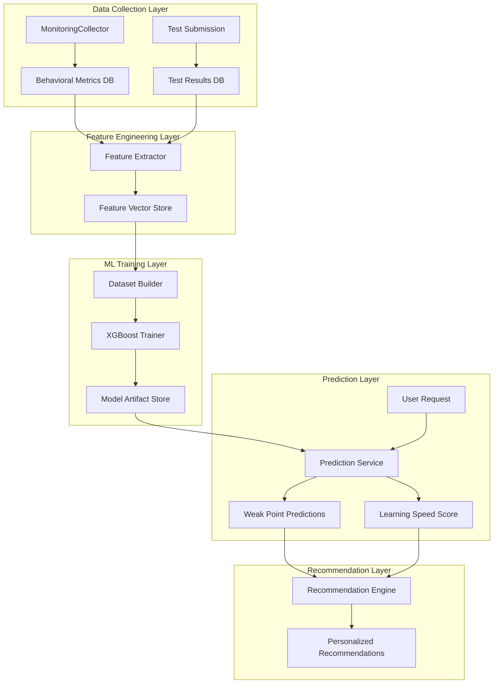

# Design Document: Weak Point Detection ML System

## Overview

This document describes the design of an ML-based system that predicts user weak points and learning speed from behavioral data and test results. The system integrates with an existing Django adaptive learning platform, using gradient boosting models to provide personalized learning recommendations.

The system follows a standard ML pipeline: data collection → feature engineering → model training → prediction → recommendation generation. It uses XGBoost for multi-task learning (weak point classification + learning speed regression) and integrates with existing Django models (StudySession, TestSubmission, WeakPoint, ConceptMastery).

## Architecture

### High-Level Architecture



### Component Interaction Flow

1. **Data Collection**: MonitoringCollector captures 8 behavioral metrics during study sessions; TestSubmission records test results with concept-level granularity
2. **Feature Engineering**: Feature Extractor aggregates behavioral metrics and test results into 32-dimensional feature vectors
3. **Training**: Dataset Builder constructs training data; XGBoost Trainer trains multi-task model weekly
4. **Prediction**: Prediction Service loads trained model and generates weak point classifications + learning speed scores
5. **Recommendation**: Recommendation Engine uses predictions to generate personalized study plans

## Components and Interfaces

### 1. Data Collection Components

#### MonitoringCollector (Existing)
**Purpose**: Captures behavioral metrics during study sessions

**Interface**:
```python
class MonitoringCollector:
    def record_question_time(user_id: int, question_id: int, duration_ms: int) -> None
    def record_wrong_attempt(user_id: int, concept_id: int) -> None
    def record_rapid_guess(user_id: int, question_id: int, duration_ms: int) -> None
    def record_pause(user_id: int, pause_duration_ms: int) -> None
    def record_video_replay(user_id: int, video_id: int) -> None
    def record_tab_switch(user_id: int, timestamp: datetime) -> None
    def record_scroll_speed(user_id: int, speed_px_per_sec: float) -> None
    def record_hint_usage(user_id: int, question_id: int) -> None
```

**Data Storage**: Stores metrics in BehavioralMetrics table with schema:
- user_id (FK to User)
- session_id (FK to StudySession)
- metric_type (enum: TIME_PER_Q, WRONG_ATTEMPT, RAPID_GUESS, PAUSE, VIDEO_REPLAY, TAB_SWITCH, SCROLL_SPEED, HINT_USAGE)
- metric_value (float)
- timestamp (datetime)
- metadata (JSON for additional context)

#### TestSubmissionHandler (Existing)
**Purpose**: Records test results with concept associations

**Interface**:
```python
class TestSubmissionHandler:
    def submit_test(user_id: int, test_id: int, answers: List[Answer]) -> TestSubmission
    def record_concept_performance(submission_id: int, concept_id: int, is_correct: bool) -> None
    def update_weak_points(user_id: int, concept_id: int, accuracy: float) -> None
```

### 2. Feature Engineering Components

#### FeatureExtractor (New)
**Purpose**: Transforms raw behavioral data and test results into ML-ready feature vectors

**Interface**:
```python
class FeatureExtractor:
    def extract_features(user_id: int, concept_id: int, lookback_days: int = 30) -> FeatureVector
    def aggregate_behavioral_metrics(user_id: int, concept_id: int) -> Dict[str, float]
    def compute_statistical_features(metrics: List[float]) -> Dict[str, float]
    def normalize_features(features: Dict[str, float]) -> np.ndarray
```

**Feature Vector Schema** (32 features):
1. **Time-based features (6)**:
   - avg_time_per_question (seconds)
   - std_time_per_question
   - cv_time_per_question (coefficient of variation)
   - min_time_per_question
   - max_time_per_question
   - rapid_guess_rate (percentage < 10 sec)

2. **Attempt-based features (4)**:
   - total_wrong_attempts
   - wrong_attempts_per_concept
   - first_attempt_accuracy
   - retry_success_rate

3. **Engagement features (8)**:
   - pause_frequency (pauses per minute)
   - avg_pause_duration (seconds)
   - video_replay_count
   - video_replay_rate (replays per video)
   - tab_switch_frequency (switches per hour)
   - avg_time_away (seconds)
   - avg_scroll_speed (px/sec)
   - erratic_scroll_ratio (% of scrolls > 2 std dev)

4. **Help-seeking features (3)**:
   - hint_usage_count
   - hints_per_question
   - hint_dependency_ratio (hints / total questions)

5. **Performance features (6)**:
   - concept_accuracy (0-1)
   - overall_accuracy (0-1)
   - accuracy_trend (slope of accuracy over time)
   - mastery_level (0-5 scale)
   - questions_attempted
   - study_session_count

6. **Temporal features (5)**:
   - days_since_first_attempt
   - days_since_last_attempt
   - study_frequency (sessions per week)
   - avg_session_duration (minutes)
   - consistency_score (regularity of study pattern)

**Normalization Strategy**:
- Min-max scaling to [0, 1] for all features
- Handle missing values with median imputation
- Store normalization parameters (min, max, median) for inference

### 3. ML Training Components

#### DatasetBuilder (New)
**Purpose**: Constructs training datasets from historical data

**Interface**:
```python
class DatasetBuilder:
    def build_training_dataset(start_date: datetime, end_date: datetime) -> Dataset
    def generate_synthetic_data(num_samples: int = 1000) -> Dataset
    def create_labels(user_id: int, concept_id: int) -> Tuple[bool, float]
    def split_dataset(dataset: Dataset, train_ratio: float = 0.8) -> Tuple[Dataset, Dataset]
```

**Dataset Schema**:
```python
@dataclass
class Dataset:
    features: np.ndarray  # Shape: (n_samples, 32)
    weak_point_labels: np.ndarray  # Shape: (n_samples,) - binary classification
    learning_speed_labels: np.ndarray  # Shape: (n_samples,) - regression target [0-100]
    user_ids: np.ndarray
    concept_ids: np.ndarray
    timestamps: np.ndarray
```

**Label Generation Logic**:
- **Weak Point Label**: 1 if concept_accuracy < 0.6, else 0
- **Learning Speed Score**: 
  ```
  learning_speed = 100 * (accuracy_improvement_rate / max_improvement_rate)
  where accuracy_improvement_rate = (current_accuracy - initial_accuracy) / days_elapsed
  ```

**Synthetic Data Generation**:
- Use realistic distributions based on domain knowledge
- Time per question: Log-normal(μ=3.5, σ=0.8) seconds
- Wrong attempts: Poisson(λ=2)
- Accuracy: Beta(α=5, β=2) for strong students, Beta(α=2, β=5) for weak students
- Correlate features realistically (e.g., high hint usage → lower accuracy)

#### ModelTrainer (New)
**Purpose**: Trains XGBoost multi-task model

**Interface**:
```python
class ModelTrainer:
    def train(train_dataset: Dataset, val_dataset: Dataset, config: TrainingConfig) -> TrainedModel
    def evaluate(model: TrainedModel, val_dataset: Dataset) -> EvaluationMetrics
    def save_model(model: TrainedModel, version: str, metadata: Dict) -> str
    def load_model(model_path: str) -> TrainedModel
```

**Model Architecture**:
```python
# Multi-task XGBoost with two objectives
model = MultiTaskXGBoost(
    tasks=[
        {
            'name': 'weak_point_classification',
            'objective': 'binary:logistic',
            'eval_metric': 'auc'
        },
        {
            'name': 'learning_speed_regression',
            'objective': 'reg:squarederror',
            'eval_metric': 'rmse'
        }
    ],
    shared_params={
        'max_depth': 6,
        'learning_rate': 0.1,
        'n_estimators': 500,
        'subsample': 0.8,
        'colsample_bytree': 0.8,
        'early_stopping_rounds': 50,
        'random_state': 42
    }
)
```

**Training Configuration**:
```python
@dataclass
class TrainingConfig:
    max_boosting_rounds: int = 500
    early_stopping_rounds: int = 50
    learning_rate: float = 0.1
    max_depth: int = 6
    min_child_weight: int = 1
    subsample: float = 0.8
    colsample_bytree: float = 0.8
    reg_alpha: float = 0.1  # L1 regularization
    reg_lambda: float = 1.0  # L2 regularization
```

**Evaluation Metrics**:
```python
@dataclass
class EvaluationMetrics:
    # Weak point classification metrics
    accuracy: float
    precision: float
    recall: float
    f1_score: float
    auc_roc: float
    
    # Learning speed regression metrics
    mae: float  # Mean Absolute Error
    rmse: float  # Root Mean Squared Error
    r_squared: float
    
    # Overall metrics
    training_time_seconds: float
    validation_samples: int
```

### 4. Prediction Components

#### PredictionService (New)
**Purpose**: Generates predictions for weak points and learning speed

**Interface**:
```python
class PredictionService:
    def __init__(self, model_path: str)
    def predict_weak_points(user_id: int) -> List[WeakPointPrediction]
    def predict_learning_speed(user_id: int) -> LearningSpeedPrediction
    def predict_batch(user_ids: List[int]) -> Dict[int, Predictions]
    def get_prediction_confidence(prediction: Prediction) -> float
```

**Prediction Output Schema**:
```python
@dataclass
class WeakPointPrediction:
    concept_id: int
    concept_name: str
    is_weak: bool
    weakness_probability: float  # 0-1
    confidence: float  # 0-1
    contributing_factors: List[str]  # Top features influencing prediction

@dataclass
class LearningSpeedPrediction:
    user_id: int
    learning_speed_score: float  # 0-100
    speed_category: str  # 'slow' (0-40), 'moderate' (40-70), 'fast' (70-100)
    confidence: float
    estimated_mastery_time: Dict[int, int]  # concept_id -> days to mastery
```

**Confidence Estimation**:
- Use prediction probability for classification (distance from 0.5 decision boundary)
- Use prediction variance for regression (ensemble of models)
- Flag low confidence when < 0.6

### 5. Recommendation Components

#### RecommendationEngine (Enhanced)
**Purpose**: Generates personalized study recommendations based on predictions

**Interface**:
```python
class RecommendationEngine:
    def generate_recommendations(
        user_id: int,
        weak_points: List[WeakPointPrediction],
        learning_speed: LearningSpeedPrediction
    ) -> List[Recommendation]
    
    def prioritize_concepts(weak_points: List[WeakPointPrediction]) -> List[int]
    def suggest_study_pace(learning_speed: float) -> StudyPaceRecommendation
    def suggest_content_type(weak_point: WeakPointPrediction) -> List[ContentRecommendation]
```

**Recommendation Schema**:
```python
@dataclass
class Recommendation:
    concept_id: int
    priority: int  # 1 (highest) to 5 (lowest)
    recommended_actions: List[Action]
    estimated_time_minutes: int
    rationale: str

@dataclass
class Action:
    action_type: str  # 'review_video', 'practice_problems', 'read_summary', 'take_quiz'
    resource_id: int
    description: str
```

**Recommendation Logic**:
1. **Prioritization**: Rank weak points by weakness_probability × concept_importance
2. **Pace Adjustment**:
   - Slow learners (0-40): More practice problems, slower content progression
   - Moderate learners (40-70): Balanced mix of content and practice
   - Fast learners (70-100): Challenge problems, advanced content, skip basics
3. **Content Selection**: Match content difficulty to learning speed and weakness severity

## Data Models

### BehavioralMetrics (New Table)
```python
class BehavioralMetrics(models.Model):
    user = models.ForeignKey(User, on_delete=models.CASCADE)
    session = models.ForeignKey(StudySession, on_delete=models.CASCADE)
    metric_type = models.CharField(max_length=50, choices=METRIC_TYPE_CHOICES)
    metric_value = models.FloatField()
    timestamp = models.DateTimeField(auto_now_add=True)
    metadata = models.JSONField(default=dict)
    
    class Meta:
        indexes = [
            models.Index(fields=['user', 'metric_type', 'timestamp']),
            models.Index(fields=['session', 'metric_type']),
        ]
```

### MLModelArtifact (New Table)
```python
class MLModelArtifact(models.Model):
    version = models.CharField(max_length=50, unique=True)
    model_type = models.CharField(max_length=50)  # 'xgboost_multitask'
    file_path = models.CharField(max_length=255)
    training_date = models.DateTimeField(auto_now_add=True)
    training_samples = models.IntegerField()
    validation_accuracy = models.FloatField()
    validation_mae = models.FloatField()
    is_active = models.BooleanField(default=False)
    metadata = models.JSONField(default=dict)  # Stores hyperparameters, feature names, etc.
    
    class Meta:
        ordering = ['-training_date']
```

### WeakPoint (Enhanced Existing Table)
```python
class WeakPoint(models.Model):
    user = models.ForeignKey(User, on_delete=models.CASCADE)
    concept = models.ForeignKey(Concept, on_delete=models.CASCADE)
    
    # Existing fields
    accuracy = models.FloatField()
    attempts = models.IntegerField()
    
    # New ML-related fields
    ml_predicted_weak = models.BooleanField(default=False)
    ml_weakness_probability = models.FloatField(null=True)
    ml_confidence = models.FloatField(null=True)
    ml_prediction_date = models.DateTimeField(null=True)
    ml_model_version = models.CharField(max_length=50, null=True)
    
    last_updated = models.DateTimeField(auto_now=True)
```

### UserLearningProfile (New Table)
```python
class UserLearningProfile(models.Model):
    user = models.OneToOneField(User, on_delete=models.CASCADE)
    learning_speed_score = models.FloatField(default=50.0)
    speed_category = models.CharField(max_length=20)  # 'slow', 'moderate', 'fast'
    ml_confidence = models.FloatField(default=0.5)
    last_prediction_date = models.DateTimeField(null=True)
    ml_model_version = models.CharField(max_length=50, null=True)
    
    # Aggregated behavioral statistics
    avg_time_per_question = models.FloatField(default=0.0)
    hint_usage_rate = models.FloatField(default=0.0)
    study_consistency_score = models.FloatField(default=0.0)
```

## API Endpoints

### Prediction API

#### POST /api/ml/predict/weak-points/
**Purpose**: Predict weak points for a user

**Request**:
```json
{
    "user_id": 123,
    "top_k": 5,
    "min_confidence": 0.6
}
```

**Response**:
```json
{
    "user_id": 123,
    "predictions": [
        {
            "concept_id": 45,
            "concept_name": "Quadratic Equations",
            "is_weak": true,
            "weakness_probability": 0.85,
            "confidence": 0.78,
            "contributing_factors": ["high_hint_usage", "low_accuracy", "many_wrong_attempts"]
        }
    ],
    "model_version": "v1.2.3",
    "prediction_timestamp": "2024-01-15T10:30:00Z"
}
```

#### POST /api/ml/predict/learning-speed/
**Purpose**: Predict learning speed for a user

**Request**:
```json
{
    "user_id": 123
}
```

**Response**:
```json
{
    "user_id": 123,
    "learning_speed_score": 72.5,
    "speed_category": "fast",
    "confidence": 0.82,
    "estimated_mastery_time": {
        "45": 7,
        "46": 5,
        "47": 10
    },
    "model_version": "v1.2.3",
    "prediction_timestamp": "2024-01-15T10:30:00Z"
}
```

#### POST /api/ml/recommendations/
**Purpose**: Get personalized study recommendations

**Request**:
```json
{
    "user_id": 123,
    "max_recommendations": 3
}
```

**Response**:
```json
{
    "user_id": 123,
    "recommendations": [
        {
            "concept_id": 45,
            "priority": 1,
            "recommended_actions": [
                {
                    "action_type": "review_video",
                    "resource_id": 789,
                    "description": "Watch: Solving Quadratic Equations Step-by-Step"
                },
                {
                    "action_type": "practice_problems",
                    "resource_id": 234,
                    "description": "Complete 10 practice problems on quadratic equations"
                }
            ],
            "estimated_time_minutes": 45,
            "rationale": "High weakness probability (0.85) with low confidence in this concept"
        }
    ]
}
```

### Training API

#### POST /api/ml/train/
**Purpose**: Trigger model retraining (admin only)

**Request**:
```json
{
    "start_date": "2024-01-01",
    "end_date": "2024-01-15",
    "use_synthetic_data": false
}
```

**Response**:
```json
{
    "status": "training_started",
    "job_id": "train_20240115_103000",
    "estimated_completion": "2024-01-15T11:00:00Z"
}
```

## Integration Points

### 1. Integration with MonitoringCollector
- **Location**: `adaptive_learning/monitoring.py`
- **Changes**: Ensure all 8 behavioral metrics are consistently recorded
- **Data Flow**: MonitoringCollector → BehavioralMetrics table → FeatureExtractor

### 2. Integration with TestSubmission
- **Location**: `adaptive_learning/models.py`
- **Changes**: Add signal handlers to trigger ML predictions after test submission
- **Data Flow**: TestSubmission saved → Signal → PredictionService → WeakPoint updated

### 3. Integration with recommendation_service.py
- **Location**: `adaptive_learning/recommendation_service.py`
- **Changes**: Enhance existing recommendation logic with ML predictions
- **Data Flow**: RecommendationEngine calls PredictionService → Combines with rule-based recommendations

### 4. Integration with WeakPoint Model
- **Location**: `adaptive_learning/models.py`
- **Changes**: Add ML prediction fields (already specified in Data Models section)
- **Migration**: Create Django migration to add new fields

## File Structure

```
adaptive_learning/
├── ml/
│   ├── __init__.py
│   ├── feature_extractor.py      # FeatureExtractor class
│   ├── dataset_builder.py        # DatasetBuilder class
│   ├── model_trainer.py          # ModelTrainer class
│   ├── prediction_service.py     # PredictionService class
│   ├── recommendation_engine.py  # Enhanced RecommendationEngine
│   ├── synthetic_data.py         # Synthetic data generation
│   └── utils.py                  # Helper functions
├── models.py                     # Enhanced with new tables
├── views.py                      # API endpoints
├── urls.py                       # URL routing
├── tasks.py                      # Celery tasks for training
└── management/
    └── commands/
        └── train_ml_model.py     # Django management command
```

